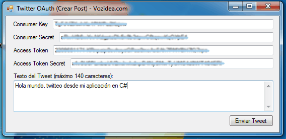

Publish-on-Twitter-OAuth-API-C-Sharp
====================================

Publicar en Twitter con C#
================================================

Como publicar en Twitter empleando la API y la autenticación OAuth mediante un programa en C#.
Un código sencillo que ejemplifica como firmar una petición a la API 1.1 de Twitter con la autenticación OAuth.
El código consiste en un proyecto de C# creado con Visual Studio 2010 bajo .Net Framework 4. Tenéis a vuestra disposición el artículo [como publicar en Twitter con API y autentificación OAuth C#](http://www.vozidea.com/publicar-en-twitter-con-api-oauth-c-sharp) que explica con detalle todo el código.

Características y requisitos
============================

Para poder usar el código es necesario disponer de las llaves "consumer key", "consumer secret", "access token" y "access token secret" que puedes ver como obtenerlas en el artículo de [como crear una aplicación en Twitter](http://www.vozidea.com/crear-una-aplicacion-en-twitter-para-usar-la-api).

Para seguir desarrollando es recomendable tener a mano la [documentación oficial de Twitter](https://dev.twitter.com/docs)

Y por último también es comveniente tener la [documentación oficial de Twitter para autorizar peticiones](https://dev.twitter.com/docs/auth/authorizing-request) aunque está en perfecto inglés.
